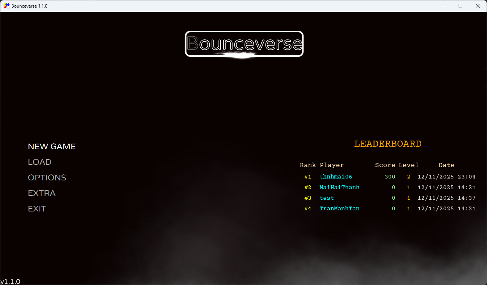
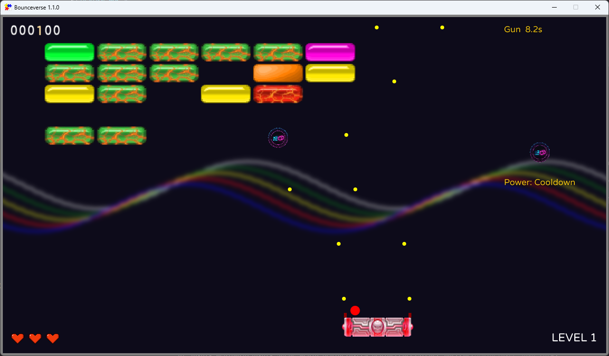
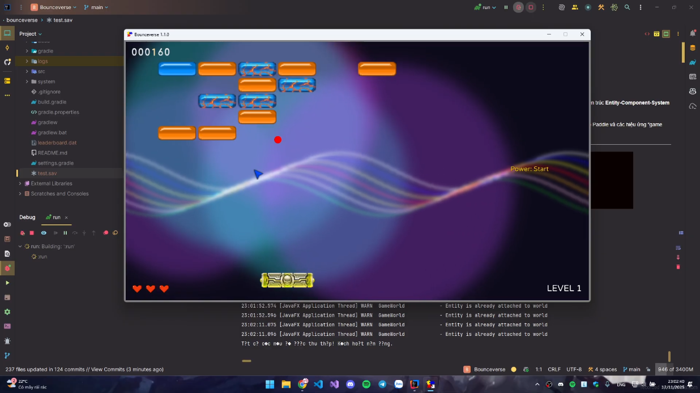

# Bounceverse - A Modern Arkanoid

### Báo cáo Bài tập lớn OOP

[Video giới thiệu](https://youtu.be/k5M-Qq1SNXU)

**Bounceverse** là một bản làm lại hiện đại của tựa game brick-breaker kinh điển, được xây dựng hoàn toàn bằng **Java** và game engine **FXGL**. Dự án này tập trung vào việc áp dụng kiến trúc **Entity-Component-System (ECS)** tiên tiến, được hỗ trợ bởi các nguyên tắc Lập trình Hướng đối tượng, để tạo ra một cấu trúc game linh hoạt, dễ bảo trì và mở rộng.

Game không chỉ tái hiện lối chơi gốc mà còn bổ sung nhiều tính năng nâng cao như hệ thống sinh màn chơi ngẫu nhiên, hệ thống vật phẩm (power-up) đa dạng, kỹ năng chủ động cho Paddle và các hiệu ứng "game feel" hiện đại để mang lại trải nghiệm hấp dẫn.

---

## Screenshots:

---

## ✨ Tính năng nổi bật

Dự án Bounceverse có các tính năng nâng cao như sau:

*   **Sinh màn chơi ngẫu nhiên:** Mỗi lần chơi là một trải nghiệm mới với thuật toán sinh map dựa trên `FastNoiseLite`, tạo ra các layout gạch độc đáo (`GameSystem.java`).

*   **Đa dạng các loại gạch:**
    *   **Gạch Thường (Normal Brick):** Gạch 1 HP.
    *   **Gạch Cứng (Strong Brick):** Gạch nhiều HP, có hiệu ứng nứt vỡ trực quan (`StrongBrickTextureUpdater`) khi nhận sát thương.
    *   **Gạch Khiên (Shield Brick):** Chỉ có thể bị phá từ một hướng nhất định.
    *   **Gạch Nổ (Exploding Brick):** Khi bị phá hủy sẽ tạo ra một vụ nổ (`Explosion`), gây sát thương cho các gạch xung quanh.
    *   **Gạch Chìa khóa (Key Brick):** Luôn luôn rơi ra vật phẩm (`Power-Up`) khi bị phá hủy.

*   **Hệ thống Vật phẩm (Power-Ups) phong phú:**
    *   `GUN`: Trang bị súng cho Paddle, tự động bắn đạn lên trên để phá gạch.
    *   `EXPAND_PADDLE`: Tăng kích thước thanh đỡ tạm thời.
    *   `SHRINK_PADDLE`: Thu nhỏ kích thước thanh đỡ tạm thời (vật phẩm bất lợi).
    *   `REVERSE_PADDLE`: Đảo ngược điều khiển của thanh đỡ (vật phẩm bất lợi).
    *   `MULTIPLE_BALL`: Nhân đôi tất cả bóng đang có trên màn hình.
    *   `FAST_BALL` / `SLOW_BALL`: Tăng hoặc giảm tốc độ của bóng.
    *   `SHIELD`: Tạo một tấm khiên ở đáy màn hình, ngăn bóng không bị rơi ra ngoài trong một thời gian.

*   **Hệ thống UI/Menu hoàn chỉnh và hiện đại:**
    *   Menu chính và menu tạm dừng được thiết kế riêng (`scenes/Menu.java`) với hiệu ứng hạt (particle effects) và hoạt ảnh mượt mà.
    *   Màn hình Game Over (`DeathSubscene`) hiển thị điểm số và cho phép nhập tên nếu lọt vào top 10.
    *   Giao diện trong game (HUD) hiển thị điểm số và mạng sống (`Hearts`, `HorizontalPositiveInteger`).

*   **Hệ thống Điểm cao (Leaderboard):**
    *   Sử dụng `LeaderboardManager` để tự động **lưu và tải 10 điểm số cao nhất** vào file `leaderboard.dat`.

*   **Hiệu ứng & "Game Feel" nâng cao:**
    *   **Nền động:** Màu nền của game thay đổi mượt mà (`BackgroundColorManager`) dựa trên tiến độ phá gạch của người chơi.
    *   **Giao diện Synthwave:** Toàn bộ giao diện game được thiết kế với phong cách neon-synthwave độc đáo (`UISystem.java`).
    *   **Âm thanh:** Quản lý âm thanh đầy đủ cho các hành động trong game.

---

## 🎮 Hướng dẫn chơi

*   **Mục tiêu:** Phá vỡ tất cả gạch để đạt điểm cao nhất.
*   **Điều khiển:**
    *   `Mũi tên Trái/Phải`: Di chuyển thanh đỡ (Paddle).
    *   `SPACE`: Phóng bóng khi bóng đang dính vào thanh đỡ (đầu màn/sau khi mất mạng).
    *   `ESC`: Tạm dừng game.
    *   `S`: Kích hoạt kỹ năng chủ động của Paddle.
---

## 🏗 Cấu trúc dự án (Thiết kế ECS & OOP)

Dự án được xây dựng trên nền tảng game engine **FXGL**, tuân thủ chặt chẽ kiến trúc **Entity-Component-System (ECS)**, kết hợp với các nguyên tắc OOP (Đóng gói, Kế thừa, Đa hình) và các Mẫu thiết kế phần mềm (Design Patterns).

### 1. Gói `systems` (Hệ thống & Vòng đời game)
*   **Bộ não của game:** Thay vì một lớp `GameManager` (God Class) khổng lồ, logic cốt lõi được chia nhỏ thành các hệ thống độc lập, kế thừa từ `InitialSystem`.
*   `Bounceverse.java`: Lớp chính điều phối các vòng đời của FXGL (`initGame`, `initPhysics`, `initUI`...).
*   `GameSystem`: Khởi tạo các thực thể ban đầu (gạch, paddle, bóng).
*   `PhysicSystem`: Định nghĩa toàn bộ logic va chạm trong game.
*   `InputSystem`: Quản lý toàn bộ input từ người chơi.
*   **Mẫu thiết kế Singleton:** Các lớp System và Manager (`LeaderboardManager`, `UserSettingsManager`) được triển khai theo mẫu Singleton (sử dụng inner class `Holder`) để đảm bảo chỉ có một thực thể duy nhất và có thể truy cập toàn cục.

### 2. Gói `factory.entities` (Sản xuất Thực thể)
*   **Mẫu thiết kế Factory:** Logic tạo ra các đối tượng trong game (`Entity`) được tách biệt hoàn toàn khỏi logic chính.
*   Mỗi lớp (`BallFactory`, `BrickFactory`, `PaddleFactory`...) chịu trách nhiệm xây dựng một loại `Entity` cụ thể, đóng gói các components và thuộc tính cần thiết cho thực thể đó.

### 3. Gói `components` (Hành vi & Thuộc tính)
*   **Trái tim của kiến trúc ECS:** Logic và dữ liệu của một `Entity` được định nghĩa bởi các `Component` mà nó chứa.
*   **`Behavior` (Hành vi):** Các lớp kế thừa từ `Behavior` định nghĩa những gì một `Entity` có thể **làm**.
    *   `Attack.java`: Hành vi gây sát thương.
    *   `HealthDeath.java`: Hành vi "chết" khi hết máu.
    *   `PaddleShooting.java`: Hành vi bắn đạn của Paddle.
    *   `Explosion.java`: Hành vi nổ của gạch.
*   **`Property` (Thuộc tính):** Các lớp kế thừa từ `Property` định nghĩa những **dữ liệu** mà một `Entity` có.
    *   `Attributes.java`: Chứa các chỉ số như phòng thủ.
    *   `Shield.java`: Chứa thông tin về các mặt được bảo vệ của gạch khiên.

### 4. Gói `scenes` & `ui` (Giao diện & Trải nghiệm)
*   Chịu trách nhiệm về mọi thứ người chơi nhìn thấy.
*   `Menu.java`: Một lớp tùy chỉnh hoàn toàn, kế thừa `FXGLMenu`, để tạo ra menu chính và menu tạm dừng với phong cách riêng.
*   `ViewElement`: Lớp cơ sở cho các thành phần UI độc lập như `Hearts` (hiển thị mạng) và `HorizontalPositiveInteger` (hiển thị điểm số).

---

### Yêu cầu:
*   Java JDK 24 (hoặc cao hơn).
*   IDE.
*   Gradle được tích hợp sẵn trong dự án.

## 🛠 Công nghệ sử dụng

*   **Ngôn ngữ:** Java (Eclipse Temurin 24)
*   **Framework:** **FXGL (FX Game Library)** - một game engine xây dựng trên nền tảng JavaFX.
*   **Công cụ Build:** Gradle.
*   **IDE:** IntelliJ IDEA / Visual Studio Code.

---

## 👨‍💻 Thành viên nhóm
| Leader Mai Hải Thành  | 24021627 | [@thnhmai06](https://github.com/thnhmai06)       |
| --------------------- | -------- | ------------------------------------------------ |
| Trần Mạnh Tân         | 24021619 | [@ManhTanTran](https://github.com/ManhTanTran)   |
| Nguyễn Huỳnh Anh Tuấn | 24021659 | [@huynhtuan372](https://github.com/huynhtuan372) |

Phân chia công việc:

| @thnhmai06                                                                                            | @ManhTanTran                                                                            | @huynhtuan372                                                               |
| ----------------------------------------------------------------------------------------------------- | --------------------------------------------------------------------------------------- | --------------------------------------------------------------------------- |
| Đồng đảm nhiệm Power-up, thiết lập và quản lý các lớp cơ sở, quản lý chung project và hệ thống level. | Đảm nhiệm hệ thống vật lý, va chạm, Brick, Paddle, đồng đảm nhiệm và dẫn xuất Power-up. | Thiết kế UI và assets, các menu, leaderboard, xử lý input, hoàn thiện Ball. |

Ball được thiết lập và phát triển ban đầu bởi minngoc123.
